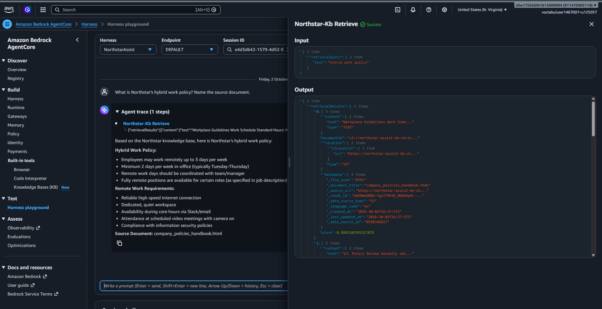

# Northstar Assist: Build Evidence

Evidence that the Northstar Assist agent and harness are deployed, answer with a foundation model, retrieve from the knowledge base, and that the knowledge base sync completed without errors. All outputs are read-only API results from account `911470903119` (`us-east-1`). The raw data is in [`build-evidence-2026-10-02.json`](build-evidence-2026-10-02.json).

| Rubric criterion | Evidence | Result |
|---|---|---|
| Harness accepts a user prompt and returns a response using a foundation model | **§0 single live capture**, §1 screenshot, §2 harness configuration, §3 transcripts | ✅ |
| Agent retrieves content from the knowledge source and uses it in the response | **§0** (Retrieve tool call, 5 retrieved chunks with sources and scores, answer quoting the top chunk), §1 screenshot, §3 retrieval queries from the invocation log | ✅ |
| Knowledge base data source sync completes without errors | **§0** and §4: ingestion job `ZPFE9LWPAN` is `COMPLETE`, 30 scanned, 30 indexed, **0 failed** | ✅ |

------------------------------------------------------------------------

## 0. Single End-to-End Capture (2026-10-03 11:30 UTC)

`capture_build_evidence.py` recorded all of the following in one run against the live, hardened harness. The raw output is [`build-evidence.json`](build-evidence.json).

**Harness:** `NorthstarAssist`, status `READY`, version 2. Model `global.anthropic.claude-haiku-4-5-20251001-v1:0` (`converse_stream`). Guardrail `bzgydako86r9` version 1. Tool: gateway `northstar-assist-gateway-bkdy1kxxxm`.

**Prompt:** "What is Northstar's hybrid work policy? Name the source document."

| Time (UTC) | Step | Evidence |
|---|---|---|
| 11:30:59 | Claude Haiku 4.5 decides to search | `ConverseStream`, `stopReason: tool_use`, **tool `northstar-kb___Retrieve`**, input `{"retrievalQuery": {"text": "hybrid work policy"}}`. Guardrail applied. Inference Region `ap-southeast-4`. |
| 11:31:01 | Knowledge base embeds the query | `InvokeModel` on `amazon.titan-embed-text-v2:0` by the KB service role (`MANAGED_KB_EMBED-…-ZCAWWBRBXU`), input text "hybrid work policy" |
| 11:31:02 | Retrieved chunks returned to the model | **5 chunks:** `company_policies_handbook.html` (score **0.9985**), `security_policy.docx` (0.9328), and `company_policies_handbook.html` (0.8964, 0.8688, 0.8626). Top chunk: "Workplace Guidelines Work Schedule Standard Hours: Monday through Friday, 9:00 AM - 6:00 PM … Core Hours: 10:00 AM - 3:00 PM …" |
| 11:31:02 | Model writes the answer from the chunks | `ConverseStream`, `stopReason: end_turn`, 3,888 input and 230 output tokens. The stream showed `tool_use` → `tool_result` → `end_turn`. |

**Answer (as streamed to the client):**

> Based on the Northstar knowledge base, here is Northstar's hybrid work policy: … **Remote Work Allowance:** Employees may work remotely up to 3 days per week · **In-Office Requirement:** Minimum 2 days per week in-office (typically Tuesday-Thursday) · **Coordination:** Remote work days should be coordinated with team/manager · **Fully Remote Positions:** Available for certain roles · **Core Hours:** 10:00 AM - 3:00 PM … **Source Document:** Company Policies Handbook (company_policies_handbook.html)

The core hours in the answer (10:00 AM - 3:00 PM) come word for word from the top retrieved chunk, and the cited source is that chunk's document.

**Knowledge base sync, read in the same run:** KB `northstar-assist-kb` is `ACTIVE`, data source `northstar-documents` is `AVAILABLE`, and ingestion job `ZPFE9LWPAN` is `COMPLETE`: **30 scanned, 30 indexed, 0 failed, no failure reasons**.

Sections 1–4 below give further supporting evidence: the playground screenshot and earlier captures.

------------------------------------------------------------------------

## 1. Harness Playground Screenshot

This is the AgentCore **Harness playground**, with harness **NorthstarAssist** and endpoint **DEFAULT** selected. It shows:
- **The prompt:** "What is Northstar's hybrid work policy? Name the source document."
- **The agent trace:** one step, the tool call **Northstar-Kb Retrieve**, with input `{"retrievalQuery": {"text": "hybrid work policy"}}`.
- **The tool output (right panel):** 5 `retrievalResults`. The top result is from `s3://northstar-assist-kb-chrst/…`, with metadata `_document_title: company_policies_handbook.html`, `_data_source_id: NTXBJ668Z7` and relevance score **0.9985**.
- **The answer:** the hybrid work policy (remote up to 3 days a week, at least 2 days in the office, and so on), ending "**Source Document:** company_policies_handbook.html".

The answer's content matches the retrieved chunk, which shows that the retrieved content was incorporated in the response.

## 2. Harness Configuration

Captured with `GetHarness`:

| Field | Value |
|---|---|
| Harness | `NorthstarAssist` (`NorthstarAssist-yH4PMorNwm`), status `READY` |
| Foundation model | `global.anthropic.claude-haiku-4-5-20251001-v1:0` (Claude Haiku 4.5), `apiFormat: converse_stream` |
| Tool | `agentcore_gateway` → `northstar-assist-gateway-bkdy1kxxxm`, which exposes `northstar-kb___Retrieve` on KB `ZCAWWBRBXU` (5 results) |
| System prompt | "You are Northstar Assist, Northstar Technologies' internal employee assistant… Always search the Northstar knowledge base tool before answering… name the source document you used…" |
| Current version | Version 2 (2026-10-03) adds guardrail `bzgydako86r9` v1. The configuration above is version 1 as captured on 2026-10-02, and the model and tools are unchanged. |

## 3. Live Transcripts with Retrieval (from `InvokeHarness` and the model invocation log)

These were captured on 2026-10-03 through `InvokeHarness`, the same API the Streamlit app uses, on the hardened harness (version 2). The retrieval query comes from the knowledge base's own embedding call (Titan Text Embeddings V2) recorded in the model invocation log, which independently confirms that a retrieval took place.

**Transcript A: hybrid work policy**

| | |
|---|---|
| Prompt | "What is Northstar's hybrid work policy?" |
| KB retrieval query (invocation log) | `"hybrid work policy"` |
| Inference Region | `ap-southeast-4` (global inference profile) |
| Stop reason | `end_turn` |

> I'll search the Northstar knowledge base for information about the hybrid work policy. Based on the Northstar knowledge base, here is Northstar's **Hybrid Work Policy** (from the **Company Policies Handbook**):
> - Employees may work remotely up to **3 days per week**
> - Minimum **2 days per week in-office** (typically Tuesday-Thursday)
> - Remote work days should be coordinated with your team and manager
> - Fully remote positions are available for certain roles (as specified in the job description)
>
> **Standard Hours:** Monday through Friday, 9:00 AM - 6:00 PM local time · **Core Hours:** 10:00 AM - 3:00 PM …

**Transcript B: parental leave**

| | |
|---|---|
| Prompt | "What is Northstar's parental leave policy, and how many weeks of paid leave do new parents get?" |
| KB retrieval query (invocation log) | `"parental leave policy paid weeks new parents"` |
| Stop reason | `end_turn` |

> Based on Northstar's company policies … According to the **Company Policies Handbook**, Northstar offers … **Primary Caregivers**: 16 weeks of paid leave · **Secondary Caregivers**: 8 weeks of paid leave · Leave must be taken within 12 months of the birth or adoption.

The source document (`northstar-knowledge-base/html/company_policies_handbook.html`) says: "Birth/Adoption Leave: 16 weeks paid leave for primary caregivers, 8 weeks paid leave for secondary caregivers. Leave must be taken within 12 months of birth/adoption." The answer matches the retrieved source exactly.

**Supporting evidence elsewhere in the project:**
- A direct, SigV4-signed MCP call to the gateway (`tools/call northstar-kb___Retrieve`, query "hybrid work policy") returned `isError: false` with chunks citing `company_policies_handbook.html`, 4 times (IAM report, §5.2).
- 42 further harness runs with their retrieval queries are in `../launch-readiness/edge-case-results.json`.

## 4. Knowledge Base Sync (Ingestion Job)

Captured with `GetKnowledgeBase`, `GetDataSource` and `ListIngestionJobs`:

| Field | Value |
|---|---|
| Knowledge base | `northstar-assist-kb` (`ZCAWWBRBXU`), status **`ACTIVE`**, type `MANAGED`, embedding model `amazon.titan-embed-text-v2:0` (1,024 dimensions) |
| Data source | `northstar-documents` (`NTXBJ668Z7`), S3 bucket `northstar-assist-kb-chrst`, status **`AVAILABLE`** |
| Ingestion job | `ZPFE9LWPAN` |
| Status | **`COMPLETE`** |
| Started → finished | 2026-10-02 16:43:54 → 16:47:27 UTC |
| Documents scanned | 30 |
| New documents indexed | **30** |
| Modified / deleted / skipped | 0 / 0 / 0 |
| **Documents failed** | **0** |

All 30 source documents (5 each of CSV, DOCX, HTML, PDF, TXT and XLSX) were indexed with no failures.

## 5. Re-capturing This Evidence

`capture_build_evidence.py` (in this folder) captures all of the above again in one run: the harness configuration, a live transcript with the streamed tool call, the matching invocation-log records (model ID, Retrieve tool input, retrieved chunk sources and scores, the answer), and the ingestion jobs. It writes `build-evidence.json`, and it needs valid Cloud Lab credentials in the repository-root `.env`. The script was run on 2026-10-03 at 11:30 UTC (§0). Sections 2–4 come from earlier read-only captures in the same account (`build-evidence-2026-10-02.json`), and they agree with it.
