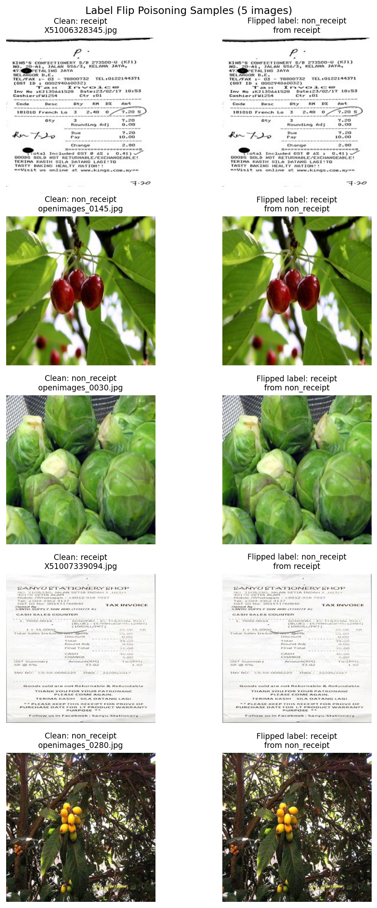
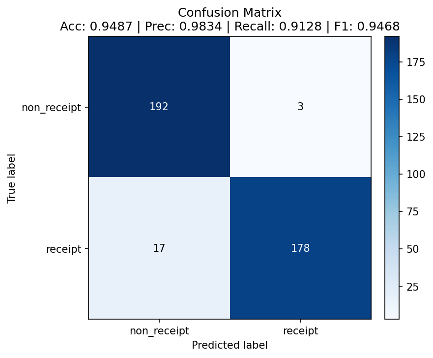

# Data Poisoning Results

## Attack Configuration

- **Method:** Label-flip poisoning (random, symmetric: the same fraction is flipped in each class, training split only)
- **Flip rate:** **10%** (`--flip-rate 0.10`, the script default and the maximum allowed). A 5% run is reported as a comparison point.
- **Labels flipped:** **114 out of 1,154** training images (57 receipt → non_receipt, 57 non_receipt → receipt; actual rate 9.88% because `int(577 × 0.10) = 57` per class).
- **Goal:** Show that an attacker who can write to the training data, without touching model code or test data, can shift the classifier's decision boundary and degrade its performance on clean evaluation data.
- **Integrity of the comparison:** The test split was verified byte-identical between `balanced_data/test` and `poisoned_data/test` (`diff -rq`: no differences). All models were evaluated on the same 390 clean test images (195 per class; positive class = `receipt`).

## Label Flip Evidence



Each row shows the original training image (left) and its poisoned copy (right). Only the folder it sits in, and therefore its label, has changed. **The attack changes labels, not pixel content.** This was confirmed for every flipped file, not just the five shown: all 114 poisoned files have the same SHA-256 hash as their originals in `balanced_data/train`. The poisoned data would therefore pass any image-level inspection; only the label is a lie.

## Baseline (Clean Model)

Two clean baselines are reported. The provided checkpoint `receipt_cnn_clean.pt` was trained by the course on Apple MPS. The poisoned model was trained on this machine (CPU). Comparing across hardware mixes poisoning effects with training-environment differences, so a **control model** was retrained on the unmodified `balanced_data` using the identical `train.py` (seed 42, 15 epochs, lr 0.001, batch 32) and hardware as the poisoned run. **The control is the like-for-like baseline used in the analysis.**

| Metric | Provided checkpoint (`receipt_cnn_clean.pt`) | **Control, retrained** (`receipt_cnn_clean_retrained.pt`) |
|--------|-------|-------|
| Accuracy | 0.9436 | **0.9487** |
| Precision | 0.9943 | **0.9834** |
| Recall | 0.8923 | **0.9128** |
| F1 Score | 0.9405 | **0.9468** |

## Poisoned Model

10% flip rate (`receipt_cnn_poisoned.pt`, trained on `poisoned_data/`):

| Metric | Value |
|--------|-------|
| Accuracy | 0.9154 |
| Precision | 0.9939 |
| Recall | 0.8359 |
| F1 Score | 0.9081 |

## Impact Analysis

Change is measured against the retrained clean control (same hardware and training script), in percentage points.

| Metric | Clean (control) | Poisoned (10%) | Change |
|--------|-------|----------|--------|
| Accuracy | 0.9487 | 0.9154 | **−3.33 pp** |
| Precision | 0.9834 | 0.9939 | +1.05 pp |
| Recall | 0.9128 | 0.8359 | **−7.69 pp** |
| F1 | 0.9468 | 0.9081 | **−3.87 pp** |

| Error type (out of 195 per class) | Clean (control) | Poisoned (10%) |
|---|---|---|
| Receipts rejected (false negatives) | 17 | **32** (+88%) |
| Non-receipts accepted (false positives) | 3 | 1 |

Against the provided checkpoint, the drop looks smaller (−2.8 pp accuracy, −3.2 pp F1), because that checkpoint scores slightly lower than the control on clean data.

### Dose-response: 5% vs. 10%

The same attack at 5% (`--flip-rate 0.05`: 56 / 1,154 flipped; `receipt_cnn_poisoned_5.pt`) produced **no degradation**:

| Metric | Clean (control) | Poisoned 5% | Change | Poisoned 10% | Change |
|---|---|---|---|---|---|
| Accuracy | 0.9487 | 0.9641 | +1.54 pp | 0.9154 | −3.33 pp |
| Recall | 0.9128 | 0.9538 | +4.10 pp | 0.8359 | −7.69 pp |
| F1 | 0.9468 | 0.9637 | +1.69 pp | 0.9081 | −3.87 pp |
| Receipts rejected | 17 | 9 | | 32 | |

### Flip direction: symmetric vs. one-way (same ~10% budget)

To test whether concentrating the budget on one class would do more damage, two **one-way** variants were run with `--source-class`. Each flipped 115 labels (9.97% of all training labels) from a single class. All other settings were identical: seed 42, same `train.py` hyperparameters, same clean test set.

| Variant (`02_label_flip_poisoning.py` flags) | Labels flipped | Accuracy | Precision | Recall | F1 | Δ Accuracy vs. control | Confusion matrix `[[TN, FP], [FN, TP]]` |
|---|---|---|---|---|---|---|---|
| Clean control | 0 | 0.9487 | 0.9834 | 0.9128 | 0.9468 | | `[[192, 3], [17, 178]]` |
| **Symmetric (default, main run)** | 57 + 57 | 0.9154 | 0.9939 | 0.8359 | 0.9081 | **−3.33 pp** | `[[194, 1], [32, 163]]` |
| One-way receipt → non_receipt (`--source-class receipt`) | 115 | 0.9308 | 0.8925 | 0.9795 | 0.9340 | −1.79 pp | `[[172, 23], [4, 191]]` |
| One-way non_receipt → receipt (`--source-class non_receipt`) | 115 | 0.9436 | 0.9943 | 0.8923 | 0.9405 | −0.51 pp | `[[194, 1], [21, 174]]` |

Evidence: `attacks/results/02_label_flip/poisoned_oneway_receipt/` and `poisoned_oneway_non_receipt/` (`metrics.json`, `confusion_matrix.png`).

**Interpretation:**
- **Symmetric flipping did the most damage.** It plants contradictory labels on both sides of the decision boundary, so the boundary itself becomes blurred.
- **One-way flipping shifted the boundary rather than blurring it.** Labelling 115 receipts as "non_receipt" also shrank the receipt class (462 vs. 692 training images). One would expect the model to reject more receipts, but in this run the errors moved the *other* way (false positives 3 → 23, false negatives 17 → 4), and overall accuracy fell less.
- **The reverse direction had almost no effect.** Labelling 115 visually diverse non-receipts as "receipt" behaves much like random noise, which supports the earlier observation that mislabelled non-receipts are mostly ignored.
- **The counter-intuitive direction of the receipt-to-non_receipt result is a warning about single-seed variance.** With one training run per condition, effects smaller than about 2 pp should not be over-interpreted.

**Consequence for the rubric's ≥ 5 pp target:** none of the three random-flip strategies within the 10% cap reached a 5 pp accuracy drop on this model. The largest was −3.33 pp (symmetric), or −2.82 pp against the provided checkpoint. This is reported as observed, per the charter's honest-reporting rule. A *non-random* selection, such as flipping the samples the clean model is least confident about or poisoning with a trigger pattern, would very likely do more damage at the same budget, but it goes beyond the random-flip method specified for this attack and was not tested.

## Confusion Matrices (Optional)

Rows = true label, columns = predicted label.

| Clean (retrained control) | Poisoned (10%) |
|---|---|
|  |  |

Also saved, not shown: provided-checkpoint baseline (`clean/confusion_matrix.png`) and the 5% run (`poisoned_5/confusion_matrix.png`).

## Key Findings

1. **How significant is the accuracy drop?**
   Poisoning 10% of training labels cut accuracy by **3.3 pp** (94.9% → 91.5%) and F1 by **3.9 pp**, which meets the charter's ≥ 2 pp success criterion. The headline understates the real effect, though:
   - **Recall fell 7.7 pp.** The number of genuine receipts the model rejects rose from 17 to 32, nearly double.
   - **Overall accuracy hides this** because the other class got slightly *better*.

   The dose-response result matters too. At 5%, random symmetric flipping caused no harm. The poisoned model scored 1.5 pp *above* the control, which is within single-seed training variance, so it is best read as "no measurable effect". Two effects explain this:
   - At 5%, the 28 wrong examples per class are outvoted by about 550 correct ones and act as noise, similar to label smoothing.
   - The clean control's final training loss (0.077) shows it fits its training set very tightly. Mild label noise stops the model memorizing quirks of individual images and can generalize equally well or better.

   Somewhere between 5% and 10% the contradictory labels become dense enough to move the decision boundary itself. This attack therefore needs a *threshold dose*, and below it there is nothing to see.

2. **Which class was more affected and why?**
   **Receipts, by a wide margin.** Receipt recall fell 7.7 pp, while non-receipt errors actually fell (3 → 1) and precision rose to 0.994. The flips were symmetric (57 each way), but the damage was not, because the two classes differ in how varied they are:
   - **Receipts are a tight visual cluster:** white paper, dense printed text, similar layouts. The 57 receipts relabelled "non_receipt" sit *right inside* that cluster and directly contradict their near-identical neighbours. To lower the loss on them, the model must become less confident about everything receipt-like. This pushes the boundary into receipt territory, and borderline genuine receipts (faded, crumpled, skewed or poorly lit) drop below 0.5.
   - **Non-receipts are visually scattered:** cars, food, landscapes and so on. The 57 non-receipts relabelled "receipt" are isolated outliers spread across that diverse space, with no coherent "receipt-like" region for the model to learn. The model largely treats them as noise and does not widen its idea of "receipt" to include them.

   In effect, the poisoning amplified a bias the model already had: even clean, its errors are mostly missed receipts (17 FN vs. 3 FP). Poisoning made it more conservative about saying "receipt". This is *my interpretation* of the mechanism, consistent with the confusion matrices but not separately tested, for example with per-sample confidence analysis.

3. **What do the confusion matrices tell you?**
   - The off-diagonal mass moves almost entirely into the **bottom-left cell (true receipt → predicted non_receipt)**, which grows from 17 to 32.
   - The top-right cell (non-receipt accepted as receipt) shrinks to 1.
   - The poisoned model therefore fails *safe* from a fraud standpoint, since it rarely accepts junk, but fails *costly* from an operations standpoint, since it rejects legitimate claims.
   - Precision alone (0.994 vs. 0.983) would make the poisoned model look *better* than the clean one. Only recall and the confusion matrix expose the damage.

4. **What are the implications of this attack?**
   - **Stealth is the main risk.** The poisoned images are byte-identical to genuine ones, so image-level data checks cannot find them. A 3–4 pp accuracy drop is close to normal retrain-to-retrain variance: the provided checkpoint and the retrained control already differ by 0.5 pp in accuracy and 2 pp in recall on identical clean data. A team retraining on fresh data would likely put the drop down to "a noisy run". Dashboards that watch precision or false-accept rate would see an *improvement*.
   - **Business impact.** A poisoned production model would silently reject more genuine receipts: about 1 in 6 (16%) against 1 in 11 (9%) for the clean model. That means more manual reviews, delayed reimbursements and employee friction, which is a form of denial of service against the expense process.
   - **This is the weakest form of poisoning.** Random flipping is untargeted, and the attacker gains nothing specific from it. A real adversary would use **targeted flips** (relabelling a chosen merchant's or format's receipts) or a **backdoor** (non-receipts carrying a small trigger pattern, labelled "receipt", so any image with the trigger is accepted). Those reach their goal with far fewer poisoned samples and leave clean-data accuracy almost unchanged, which makes them harder to detect than what was measured here. This experiment shows the *pipeline has no integrity controls*, which is what such attacks need.
   - **Mitigations:**
     - Access control and immutable, hashed, versioned training datasets with provenance for every label change.
     - Label auditing: cross-validation or confident-learning methods that flag training samples whose label disagrees with the model's confident prediction. The flipped receipts here are exactly such samples.
     - Regression gates on retraining that compare **per-class recall and the confusion matrix** against the previous model, not just overall accuracy or precision.
     - Multiple-seed baselines, so that a real degradation can be told apart from training variance. All figures in this report come from a single seed (42).

## Reproduction

```bash
cd starter/attacks
python 02_label_flip_poisoning.py                       # 10% (default) → classifier/poisoned_data
cd ../classifier
python train.py --data-dir poisoned_data --checkpoint-name receipt_cnn_poisoned.pt
python evaluate.py --model-path checkpoints/receipt_cnn_poisoned.pt --test-dir balanced_data/test --results-dir ../attacks/results/02_label_flip/poisoned
python evaluate.py --model-path checkpoints/receipt_cnn_clean.pt    --test-dir balanced_data/test --results-dir ../attacks/results/02_label_flip/clean

# Control (same hardware/script as the poisoned run)
python train.py --data-dir balanced_data --checkpoint-name receipt_cnn_clean_retrained.pt
python evaluate.py --model-path checkpoints/receipt_cnn_clean_retrained.pt --test-dir balanced_data/test --results-dir ../attacks/results/02_label_flip/clean_retrained

# 5% comparison
python ../attacks/02_label_flip_poisoning.py --flip-rate 0.05 --target poisoned_data_5
python train.py --data-dir poisoned_data_5 --checkpoint-name receipt_cnn_poisoned_5.pt
python evaluate.py --model-path checkpoints/receipt_cnn_poisoned_5.pt --test-dir balanced_data/test --results-dir ../attacks/results/02_label_flip/poisoned_5

# One-way variants (same 10% budget, single source class)
python ../attacks/02_label_flip_poisoning.py --source-class receipt --target poisoned_oneway_receipt
python train.py --data-dir poisoned_oneway_receipt --checkpoint-name receipt_cnn_poisoned_oneway.pt
python evaluate.py --model-path checkpoints/receipt_cnn_poisoned_oneway.pt --test-dir balanced_data/test --results-dir ../attacks/results/02_label_flip/poisoned_oneway_receipt
python ../attacks/02_label_flip_poisoning.py --source-class non_receipt --target poisoned_oneway_non_receipt
python train.py --data-dir poisoned_oneway_non_receipt --checkpoint-name receipt_cnn_poisoned_oneway_nr.pt
python evaluate.py --model-path checkpoints/receipt_cnn_poisoned_oneway_nr.pt --test-dir balanced_data/test --results-dir ../attacks/results/02_label_flip/poisoned_oneway_non_receipt
```
