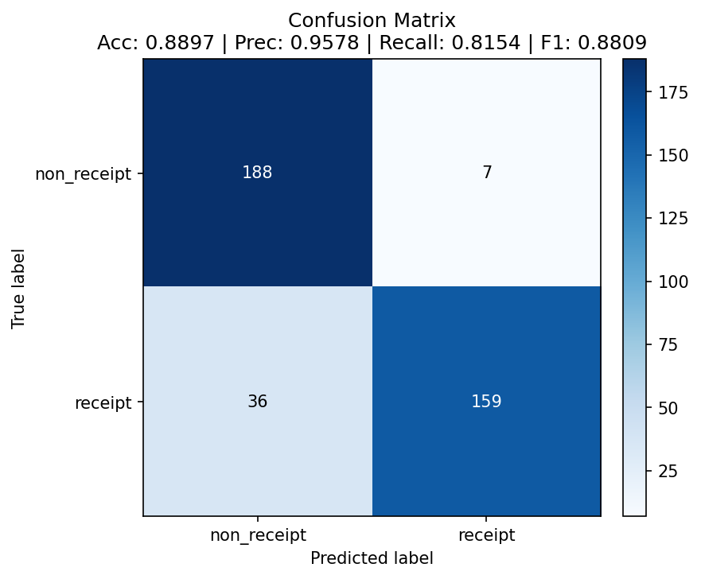

# Data Poisoning Results

## Attack Configuration

- **Method:** Targeted label-flip poisoning. The attacker uses the clean model to choose *which* training images to flip, then moves them to the opposite class folder. Only the training split is touched.
- **Selection strategy:** `confident`. In each class, flip the images the clean model (`receipt_cnn_clean.pt`) is **most confident** about: the clearest, most typical examples. Their confidence in the true class was 0.999–1.000. This is the script default (`--selection confident`).
- **Flip rate:** 10% per class, the maximum allowed (`--flip-rate 0.10`).
- **Labels flipped:** **114 out of 1,154** training images (57 receipt → non_receipt, 57 non_receipt → receipt; actual rate 9.88% because `int(577 × 0.10) = 57` per class).
- **Goal:** Show that an attacker with write access to the training data and access to the model can choose a small set of labels to corrupt and cause far more damage than random corruption, without touching model code, test data or a single pixel.
- **Integrity of the comparison:**
  - The test split was verified byte-identical between `balanced_data/test` and `poisoned_data/test` (`diff -rq`).
  - The clean dataset still matches `balanced_data_SHA256SUMS.txt`.
  - All models were evaluated on the same 390 clean test images (195 per class; positive class = `receipt`).

Why targeted? Random flipping at the same 10% budget reduced accuracy by only 3.33 pp (see the strategy comparison below), short of the ≥ 5 pp target. Targeted selection is what a capable adversary would do, and it is permitted for this attack.

## Label Flip Evidence


Each row shows the original training image (left) and its poisoned copy (right). Only the folder it sits in, and therefore its label, has changed. **The attack changes labels, not pixel content.** This was confirmed for every flipped file, not just the five shown: all 114 poisoned files have the same SHA-256 hash as their originals in `balanced_data/train`.

The sample also shows what targeted selection picks:
- **Flipped non-receipts:** vivid, saturated close-ups of fruit, vegetables and foliage (cherries, brussels sprouts, loquats). This is a visually *coherent* group, not a random mix.
- **Flipped receipts:** 56 of the 57 are clean, high-contrast scans from the same receipt family (`X5100…` filenames). They are the most textbook receipts in the set.

## Baseline (Clean Model)

Two clean baselines are reported. The provided checkpoint `receipt_cnn_clean.pt` was trained by the course on Apple MPS. The poisoned models were trained on this machine (CPU). To keep the comparison like-for-like, a **control model** was retrained on the unmodified `balanced_data` using the identical `train.py` (seed 42, 15 epochs, lr 0.001, batch 32) and hardware. **The control is the primary baseline.**

| Metric | Provided checkpoint (`receipt_cnn_clean.pt`) | **Control, retrained** (`receipt_cnn_clean_retrained.pt`) |
|--------|-------|-------|
| Accuracy | 0.9436 | **0.9487** |
| Precision | 0.9943 | **0.9834** |
| Recall | 0.8923 | **0.9128** |
| F1 Score | 0.9405 | **0.9468** |

## Poisoned Model

Targeted (`confident`) 10% flip, `receipt_cnn_poisoned.pt`, trained on `poisoned_data/` with `train.py`:

| Metric | Value |
|--------|-------|
| Accuracy | 0.8795 |
| Precision | 0.8394 |
| Recall | 0.9385 |
| F1 Score | 0.8862 |

## Impact Analysis

| Metric | Clean (control) | Poisoned (targeted 10%) | Change vs. control | Change vs. provided checkpoint |
|--------|-------|----------|--------|--------|
| Accuracy | 0.9487 | 0.8795 | **−6.92 pp** | **−6.41 pp** |
| Precision | 0.9834 | 0.8394 | **−14.40 pp** | −15.49 pp |
| Recall | 0.9128 | 0.9385 | +2.57 pp | +4.62 pp |
| F1 | 0.9468 | 0.8862 | **−6.06 pp** | −5.43 pp |

| Error type (out of 195 per class) | Clean (control) | Poisoned (targeted 10%) |
|---|---|---|
| **Non-receipts accepted as receipts** (false positives) | 3 | **35** (×11.7) |
| Receipts rejected (false negatives) | 17 | 12 |

**The accuracy drop is 6.92 pp against the control, and 6.41 pp against the provided checkpoint. Both exceed the ≥ 5 pp target.** It comes from the same 9.88% budget that, chosen at random, did a little over half as much damage.

### Strategy comparison (all on the same clean test set)

Every run used the same `train.py` settings, seed 42 and CPU. Only the selection of which labels to flip differs.

| Run (`02_label_flip_poisoning.py` flags) | Labels flipped | Accuracy | Precision | Recall | F1 | Δ Acc vs. control | Confusion `[[TN, FP], [FN, TP]]` | Evidence (`results/02_label_flip/`) |
|---|---|---|---|---|---|---|---|---|
| Clean control | 0 | 0.9487 | 0.9834 | 0.9128 | 0.9468 | | `[[192, 3], [17, 178]]` | `clean_retrained/` |
| **Targeted: confident** (default) | 57 + 57 | **0.8795** | 0.8394 | 0.9385 | 0.8862 | **−6.92 pp** | `[[160, 35], [12, 183]]` | `poisoned/` |
| Targeted: boundary (`--selection boundary`) | 57 + 57 | 0.8897 | 0.9578 | 0.8154 | 0.8809 | **−5.90 pp** | `[[188, 7], [36, 159]]` | `poisoned_boundary/` |
| Random, symmetric 10% (`--selection random`) | 57 + 57 | 0.9154 | 0.9939 | 0.8359 | 0.9081 | −3.33 pp | `[[194, 1], [32, 163]]` | `poisoned_random/` |
| Random, one-way receipt → non_receipt | 115 | 0.9308 | 0.8925 | 0.9795 | 0.9340 | −1.79 pp | `[[172, 23], [4, 191]]` | `poisoned_oneway_receipt/` |
| Random, one-way non_receipt → receipt | 115 | 0.9436 | 0.9943 | 0.8923 | 0.9405 | −0.51 pp | `[[194, 1], [21, 174]]` | `poisoned_oneway_non_receipt/` |
| Random, symmetric 5% (`--flip-rate 0.05 --selection random`) | 28 + 28 | 0.9641 | 0.9738 | 0.9538 | 0.9637 | +1.54 pp | `[[190, 5], [9, 186]]` | `poisoned_5/` |

## Confusion Matrices (Optional)

Rows = true label, columns = predicted label.

| Clean (retrained control) | Poisoned (targeted 10%) |
|---|---|
|  |  |
| **Targeted: boundary** | **Random, symmetric 10%** |
|  |  |

## Key Findings

1. **How significant is the accuracy drop?**
   - **Significant, and the choice of labels decides it.** Flipping the 10% of labels the clean model was most sure about cut accuracy by **6.92 pp** (94.9% → 88.0%) and F1 by 6.06 pp. Precision collapsed by **14.4 pp**.
   - **Same budget, chosen at random:** −3.33 pp.
   - **Random 5%:** no measurable effect (+1.54 pp, within single-seed variance).
   - **Targeting near the boundary instead:** −5.90 pp.

   The lesson for defenders: the *number* of corrupted labels is a poor measure of risk. An attacker who can query the model can concentrate a small budget where it hurts most. The training loss confirms the model was fighting contradictory data. It finished at 0.40 for the targeted run, against 0.08 for the clean control and 0.28 for random flipping, because confidently-labelled "contradictions" are the hardest for the model to fit.

2. **Which class was more affected and why?**
   **Non-receipts.** The targeted model accepts **35 of 195 non-receipts as receipts**, against 3 for the clean model. Genuine-receipt handling slightly *improved* (rejections 17 → 12). This is the opposite of random flipping, which mainly damaged receipts (rejections 17 → 32). The mechanism differs because of *what* gets flipped:
   - **Flipped non-receipts form a coherent concept.** Ranking by confidence picks the most extreme non-receipt images. Here these are vivid, saturated, natural-texture photos (fruit, vegetables, foliage). Labelling 57 of them "receipt" teaches the model a consistent and learnable rule: *this kind of photo can be a receipt*. Test non-receipts that share those features cross the boundary, producing the 35 false positives. Random flips, by contrast, are scattered across very different photos (cars, food, scenes), and the model treats them as noise.
   - **Flipped receipts are outvoted.** The 57 flipped receipts are the most textbook receipts, almost all from one scan family. Labelling them "non_receipt" contradicts the tightest part of the receipt cluster, but 520 other receipts, including 140 from a second family that was barely touched, keep pulling the model back. That pull leaves the receipt side intact, and somewhat more permissive.
   - **Boundary selection does the opposite.** It hurts receipts (rejections 17 → 36), because the flipped images are already ambiguous and the receipt cluster is where most ambiguity lives. Which class is damaged therefore depends on the selection strategy, not on the budget.

   This mechanism is *my interpretation*. It is consistent with the selected images and the confusion matrices, but it was not separately tested (for example by feature-space analysis).

3. **What do the confusion matrices tell you?**
   - The damage moves into the **top-right cell (true non_receipt → predicted receipt)**, which grows from 3 to 35.
   - The bottom-left cell (missed receipts) shrinks from 17 to 12.
   - **Recall improves, so a dashboard that watched only recall or the receipt-rejection rate would report the poisoned model as *better*.** Only precision, the confusion matrix or per-class error rates reveal the damage.
   - Random and boundary poisoning show the mirror image: damage to receipts, and precision that looks fine. A single headline metric can miss poisoning in either direction, depending on how the attacker selects.

4. **What are the implications of this attack?**
   - **The fraud risk is real.** The targeted model accepts about 1 in 6 non-receipt images (18%) as receipts, against about 1 in 65 (1.5%) for the clean model. In an expense pipeline that is a direct path to approving claims without valid receipts. Unlike FGSM (Attack 1), it needs **no per-submission manipulation**: once the model is poisoned, ordinary images of the right kind pass.
   - **It is stealthy.** Every poisoned file is byte-identical to a genuine one, only 9.88% of labels changed, and the flipped images are individually unremarkable. Recall even rises, so the model "looks" better at its main job of accepting receipts.
   - **Model access makes poisoning more powerful.** Targeted selection needed only query access to a clean model, which the white-box FGSM threat model already assumes. Protecting the model and its scores also protects the training pipeline.
   - **Mitigations:**
     - Access control and immutable, hashed, versioned training datasets with provenance for every label change. `balanced_data_SHA256SUMS.txt` is a minimal version of this, and it would detect any change to the *images*.
     - **Label auditing:** cross-validation or confident-learning methods that flag samples whose label strongly disagrees with a confident prediction. *Targeted-confident flips are the easiest case for this defence*, because every flipped sample is maximally disagreeing.
     - Regression gates on retraining that compare **precision, recall and the full confusion matrix per class** against the previous model, not one headline metric.
     - Multiple-seed baselines, so a real degradation can be told apart from training variance.

**Limitations and honest reporting:**
- All results come from a single training seed (42). The targeted result clears the 5 pp target by 1.9 pp against the control (1.4 pp against the provided checkpoint). Effects under about 2 pp, such as the one-way random runs and the 5% result, should not be over-interpreted.
- The random-selection results that missed the target are kept above deliberately, because they are what show the value of targeting.
- The selection used the provided clean checkpoint. An attacker with only black-box query access could do the same through the classifier's output scores.

## Reproduction

```bash
cd starter/attacks
python 02_label_flip_poisoning.py          # default: --selection confident --flip-rate 0.10 -> classifier/poisoned_data
cd ../classifier
python train.py --data-dir poisoned_data --checkpoint-name receipt_cnn_poisoned.pt
python evaluate.py --model-path checkpoints/receipt_cnn_poisoned.pt --test-dir balanced_data/test --results-dir ../attacks/results/02_label_flip/poisoned
python evaluate.py --model-path checkpoints/receipt_cnn_clean.pt    --test-dir balanced_data/test --results-dir ../attacks/results/02_label_flip/clean

# Control (same hardware/script as the poisoned run)
python train.py --data-dir balanced_data --checkpoint-name receipt_cnn_clean_retrained.pt
python evaluate.py --model-path checkpoints/receipt_cnn_clean_retrained.pt --test-dir balanced_data/test --results-dir ../attacks/results/02_label_flip/clean_retrained

# Comparison runs: change only the selection flags, keep everything else identical
python ../attacks/02_label_flip_poisoning.py --selection boundary --target poisoned_data_boundary
python train.py --data-dir poisoned_data_boundary --checkpoint-name receipt_cnn_poisoned_boundary.pt
python evaluate.py --model-path checkpoints/receipt_cnn_poisoned_boundary.pt --test-dir balanced_data/test --results-dir ../attacks/results/02_label_flip/poisoned_boundary

python ../attacks/02_label_flip_poisoning.py --selection random --target poisoned_data_random
python train.py --data-dir poisoned_data_random --checkpoint-name receipt_cnn_poisoned_random.pt
python evaluate.py --model-path checkpoints/receipt_cnn_poisoned_random.pt --test-dir balanced_data/test --results-dir ../attacks/results/02_label_flip/poisoned_random
# Further variants: add --flip-rate 0.05, or --source-class receipt|non_receipt, to the random run
```
