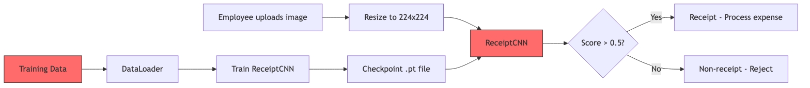
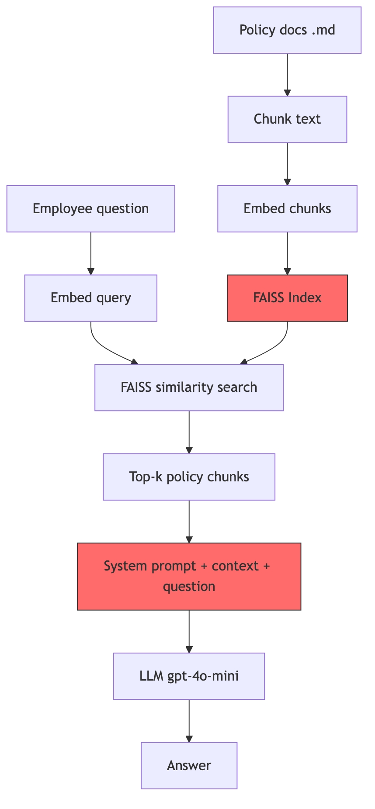
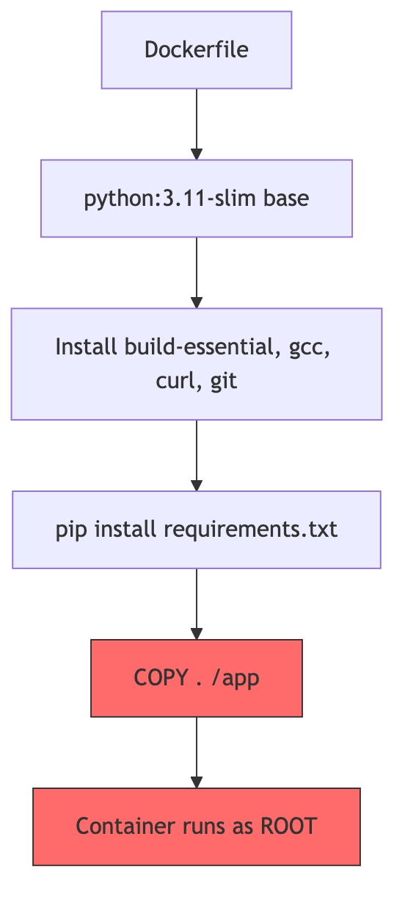

# System Architecture

## Overview

FinanceGuard's AI infrastructure consists of two primary systems with distinct attack surfaces.

## Receipt Classifier



### Attack Surfaces

- **Model input (FGSM):** Adversarial perturbations to input images can flip predictions.
- **Training data (poisoning):** Corrupted labels in training data degrade model accuracy.

### Model Architecture

```text
ReceiptCNN:
    Conv2d(3→16) → BatchNorm → ReLU → MaxPool    # 224→112
    Conv2d(16→32) → BatchNorm → ReLU → MaxPool   # 112→56
    Conv2d(32→64) → BatchNorm → ReLU → MaxPool   # 56→28
    GlobalAvgPool                                 # 28→1
    Dropout(0.3)
    Linear(64→32) → ReLU
    Linear(32→1) → Sigmoid                       # Binary output
```

- **Input:** 224×224 RGB image
- **Output:** Score in [0, 1]; receipt if greater than 0.5
- **Loss:** `BCELoss`
- **Parameters:** Approximately 26K (lightweight custom CNN)

## RAG Chatbot



### Attack Surfaces

- **Vector store (exfiltration):** FAISS has no access control. Any semantically similar query can retrieve any document, including confidential ones.
- **System prompt (injection):** Crafted user input may override the LLM's system prompt.

### RAG Pipeline Flow

- **Build phase:** Policy documents are chunked (500 characters, 50-character overlap), embedded via `text-embedding-3-small`, and stored in a FAISS `IndexFlatL2` index.
- **Query phase:** The user question is embedded, FAISS returns the top three nearest chunks, and the chunks are passed as context to `gpt-4o-mini` to generate an answer.

### Key Vulnerability

The `data/policies/` directory contains four documents:

- `expense_policy.md` (public)
- `travel_policy.md` (public)
- `reimbursements_faq.md` (public)
- `executive_bonus_structure_CONFIDENTIAL.md` (restricted)

All four documents are indexed in the same FAISS vector store without access-control differentiation. A query semantically related to compensation can retrieve the confidential document.

## Deployment Infrastructure



### Attack Surface

The Dockerfile and container dependencies may contain known vulnerabilities (CVEs) and configuration weaknesses that could be exploited.